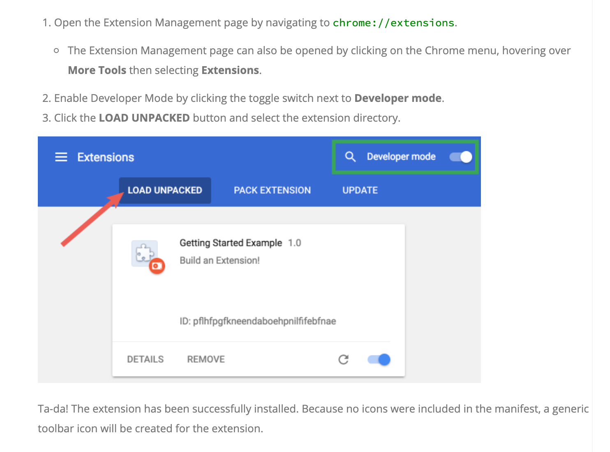
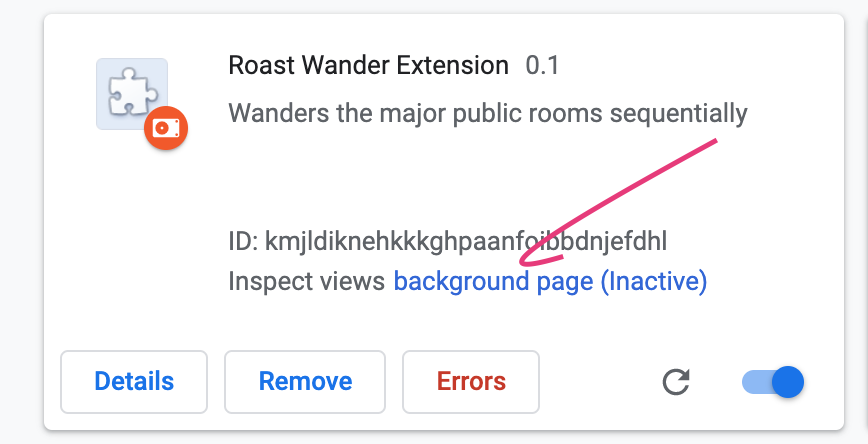

chrome extension to wander public spaces at roast.

# Using the extension

1. Download or clone this repo
2. Follow these instructions to add the extension folder to chrome

Reproduced from..
https://developer.chrome.com/extensions/getstarted#unpacked

3. You (might? I'm not sure) need to open the `roast wander` "Background Page" from the `chrome://extensions/` page.

[Otherwise, we can't maintain state between jitsi pages to keep going if there's nobody in the room. (I think?) Try, and give a pull request or let me know!]

4. You then need to go to your first jitsi room e.g. [https://meet.jit.si/seniorhouseexample](https://meet.jit.si/seniorhouseexample), and hit the "R" button in the browser.

**NOTE:** If there are multiple people in the room, you have to hit the "R" button a few times.
